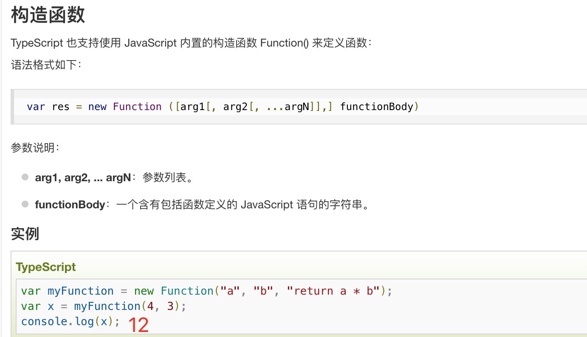
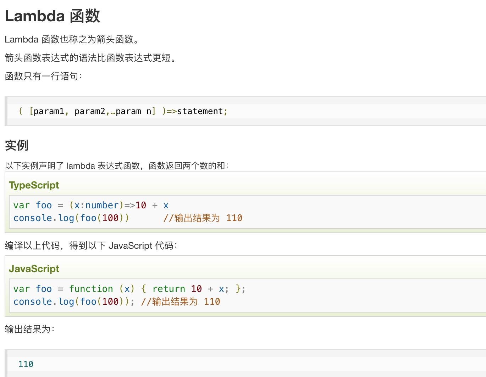
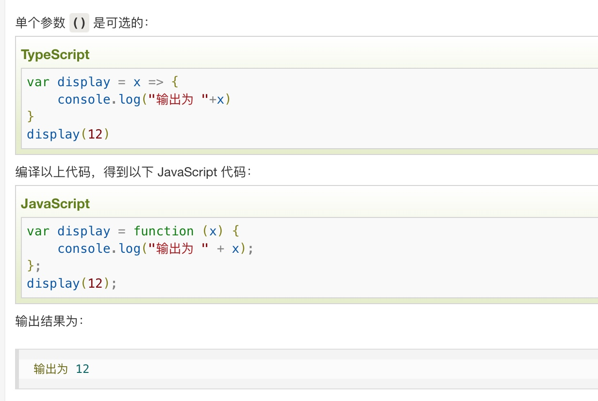

# React_DailyWorking
React学习
## 1.react中条件渲染（03_condition.html）
* if条件判断
* 三元运算符
* &&与运算符
* v-show效果
## 2.高阶函数用法
```
totalPrice = books.reduce((preValue, item) => {
                    return preValue + item.count * item.price
                }, 0)
```
## 3. 浅拷贝...
```
[...this.state.books]
```


# TypeScript学习
## 




